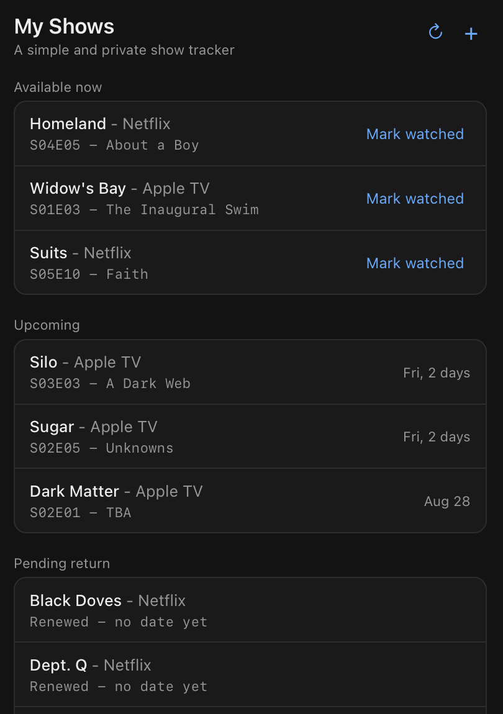
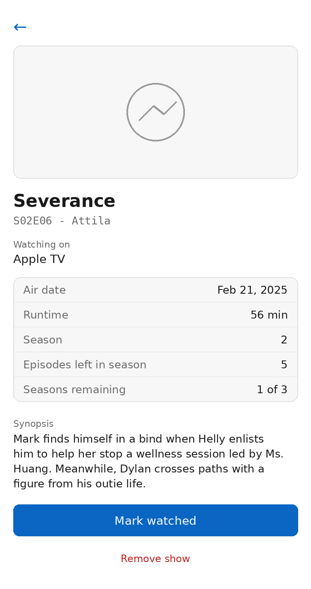

# My Shows

A simple TV episode tracker: keep a list of shows you're watching, mark episodes watched, and always see what's next.

## Why this exists

Built after the TV Time app shut down. The goal was a minimal replacement that does one thing well: given a show and where you left off, tell you what episode to watch next — with no ads, no account, no social feed, and no clutter.

## Screenshots

| List view | Detail view |
| --- | --- |
|  |  |

## What it does

- **Add a show** by searching (data comes from [TVmaze](https://www.tvmaze.com), a free public TV database — no account or API key needed)
- **Track your progress** by entering the last episode you watched; the app figures out what's next
- **Note where you're watching it** (Hulu, Netflix, whatever) — shown next to the show name and on the episode detail screen
- **Groups your shows** into:
  - **Available now** — the next episode has already aired
  - **Upcoming** — a future air date is known, with a countdown
  - **Pending return** — the show is renewed but no return date has been announced yet
  - **Completed** — you've watched everything and the series has ended
- **Includes specials** (Christmas specials, series finales tagged as specials, etc.) in their correct place in the timeline, based on air date — not just numbered regular episodes
- **One tap to mark watched**, which then shows the next episode
- **Suspend a series without deleting it** — from the detail screen, tap "Suspend series" to move a show into Completed and mark it Archived (with the date), without losing your watch history. Its detail screen keeps a record of your last watched episode, episodes/seasons that were remaining, and when you archived it. Tap "Reactivate" on that row (or "Reactivate series" on its detail screen) to pick back up exactly where you left off

## How it's built

A single self-contained `index.html` file — plain HTML, CSS, and JavaScript. No build step, no framework, no dependencies to install. It calls the public TVmaze API directly from your browser.

## Data storage — read this

**Your show list is stored only in your browser's local storage on your device.** This means:

- **No automatic backup or sync.** There is no account and no server storing anything.
- **iOS can clear it unexpectedly.** For apps added to the home screen, iOS does not guarantee `localStorage` persists indefinitely — it can be cleared under storage pressure, after a restart, or after a period of inactivity. This is a platform limitation, not something the app can prevent.
- **Manual backup/restore is built in** for exactly this reason: tap the ↻ icon on the main screen to download a backup file, and restore from it later if your list ever disappears.
- **No sharing between devices.** Adding a show on your phone doesn't make it appear on your laptop. Each browser/device has its own separate list, though you can move a backup code between devices manually.
- **Nothing is sent anywhere except TVmaze.** The only network requests this app makes are to `api.tvmaze.com`. Your watch list itself never leaves your device unless you manually copy/paste a backup code somewhere.
- **The code being public does not expose your data** — see the hosting note below.

## Backup and restore

Tap the ↻ icon on the main screen (next to the + button) to open **Backup & restore**.

- **Download backup file** — saves a `.json` file with your entire list (every show, its platform, and your watched progress). On iPhone, tapping this opens Safari's file preview screen rather than saving directly — this is a standard iOS restriction that applies to any website, not something specific to this app. From that screen: tap **More...** → **Save to Files** → choose a location (On My iPhone, or an iCloud Drive folder if you want it to sync across devices) → **Save**.
- **Choose backup file** — pick a previously saved backup file to restore it. This replaces whatever's currently on the device with the contents of that file, so use it when your list has disappeared or you're setting up a new device.

A few things worth knowing:

- The file has nothing device-specific baked into it, so restoring on a different device or a different hosted copy of the app works identically to restoring on the same one.
- To move a backup between devices, use whatever you'd normally use to move a file — AirDrop, iCloud Drive, email, Messages.
- Restoring is a full replace, not a merge — if you have shows on the device that aren't in the backup file, they'll be gone after restoring. Download a fresh backup first if you want to keep both.
- This is a manual step, not automatic — the app doesn't back itself up on a schedule, so it's worth downloading a fresh backup occasionally, especially before an iOS update or if you haven't opened the app in a while (see the storage note above on why).

## Hosting your own copy on GitHub Pages

This needs to run from a real `https://` web address rather than being opened as a downloaded file — iOS Safari in particular blocks network requests (like the TVmaze lookups) from local files for security reasons, even though desktop Safari usually allows it.

1. Go to [github.com/new](https://github.com/new), create a **public** repository (e.g. `my-shows`), and don't initialize it with any files.
2. On the repo page, choose **uploading an existing file**, drag in `index.html`, and commit.
3. Go to **Settings → Pages**, set Source to **Deploy from a branch**, branch `main`, folder `/ (root)`, and save.
4. After a minute or so, GitHub gives you a URL like `https://yourusername.github.io/my-shows/`. Open that on your phone, then use Safari's **Share → Add to Home Screen** to get an app-like icon.

### Or use an already-hosted copy

If you'd rather skip hosting it yourself, there's a running instance here: **https://myshows.fyi**

Your data is still private and local to your own device even using this shared instance — the app has no backend and no database. Every request it makes (aside from looking up show/episode data from TVmaze) stays in your browser's local storage, regardless of which server happens to be serving the static `index.html`/JS files. The same iOS storage-eviction caveat described above still applies either way, since that's about your browser's storage, not about who's hosting the page.

## Customizing this with Claude

This app was originally built with [Claude](https://claude.ai). To make changes (add a feature, change the design, fix something), the easiest path is to start a new conversation with Claude and give it context, since a fresh conversation won't know this app's history or the decisions baked into it.

**Included in this repo for that purpose:**
- `CLAUDE_CONTEXT.md` — a technical primer describing the app's data model, architecture, and a few non-obvious gotchas (documented so they don't get silently reintroduced by a future change)
- `logic.js` / `logic.test.js` / `app.test.js` — the core logic pulled out into a testable module, plus the test suite used to verify behavior (episode ordering, specials handling, watched-progress tracking, etc.)

**To customize:**
1. Open a new conversation with Claude.
2. Paste in the contents of `CLAUDE_CONTEXT.md`, or just say "here's the context for an app I'm working on" and attach it.
3. Paste in `index.html` (or attach it) and describe the change you want.
4. Ask Claude to test its changes — the existing test files are there so a change can be checked against the behavior that's already been verified, rather than guessing.
5. Once you have an updated `index.html`, upload it to the GitHub repo (Add file → Upload files, replacing the old one) to deploy the change.

## Limitations

- No login, no cloud sync, no cross-device support
- No notifications when a new episode airs — you have to open the app to check
- Relies entirely on TVmaze's data — if a show isn't in their database, or their episode/special data has gaps, that carries through to the app
